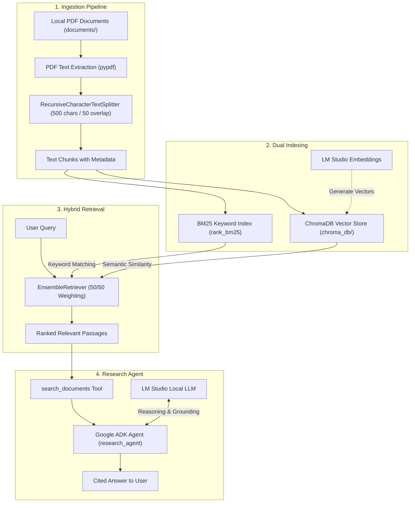

# Local Document Research Agent

A privacy-focused, local-first research agent built with **Google ADK (Agent Development Kit)**, **LM Studio**, and **LangChain**. It enables you to chat with your local PDF documents using an intelligent **Hybrid Search** engine combining keyword-based (BM25) and semantic (Vector) retrieval.

---

## ✨ Features

- **100% Local & Private**: All document processing, vector storage, embeddings, and LLM inference run locally on your machine via LM Studio.
- **Hybrid Retrieval (Ensemble)**:
  - **BM25 Keyword Search**: Excels at retrieving exact matches such as SKU numbers, error codes, policy section numbers, and specialized jargon.
  - **Dense Vector Search**: Captures contextual meaning, synonyms, and conceptual queries using ChromaDB.
  - **Reciprocal Rank Fusion**: Merges both retriever outputs with balanced 50/50 weighting using `EnsembleRetriever`.
- **Smart Chunking**: Uses `RecursiveCharacterTextSplitter` (500 chars, 50 overlap) with paragraph and newline awareness to preserve semantic coherence.
- **Batch PDF Ingestion**: Scans the `documents/` folder and processes all PDFs automatically.
- **Google ADK Agent**: Uses an agentic architecture equipped with search tools and strict anti-hallucination instructions.

---

## 🏗️ Architecture



---

## 📋 Prerequisites

1. **Python**: Version `3.13+`
2. **Package Manager**: [`uv`](https://github.com/astral-sh/uv) (recommended) or standard `pip`
3. **Local LLM Server**: [LM Studio](https://lmstudio.ai/) running with:
   - A chat/instruction model loaded (e.g. `qwen_qwen3-8b`)
   - An embedding model loaded (e.g. `text-embedding-qwen3-embedding-0.6b`)
   - Local server started at `http://localhost:1234/v1`

---

## ⚙️ Configuration

Create a `.env` file in the project root directory with your LM Studio settings:

```dotenv
LM_STUDIO_BASE_URL=http://localhost:1234/v1
LM_STUDIO_API_KEY=lm-studio

# Model identifiers configured in LM Studio
LM_STUDIO_LLM_MODEL=qwen_qwen3-8b
LM_STUDIO_EMBEDDING_MODEL=text-embedding-qwen3-embedding-0.6b
```

> **Note**: `check_embedding_ctx_length=False` is enabled in the embedding configuration to ensure compatibility with LM Studio's `/embeddings` endpoint.

---

## 🚀 Getting Started

### 1. Clone & Install Dependencies

Using `uv` (recommended):
```powershell
uv sync
```

Or install with `pip`:
```powershell
pip install -r pyproject.toml
```

### 2. Add Documents

Place any PDF documents you want to research inside the `documents/` folder:

```powershell
documents/
  ├── company_hr_policy.pdf
  └── technical_spec.pdf
```

### 3. Ingest Documents

Run the batch ingestion script:

```powershell
uv run python ingest.py
```

This will:
- Extract text from each PDF in `documents/`
- Split the text into ~500-character chunks
- Generate vector embeddings through LM Studio
- Store chunks and metadata in the local `chroma_db/` directory

### 4. Run the Research Agent

Launch the agent's web interface powered by Google ADK:

```powershell
uv run adk web
```

Open the displayed local URL in your browser to start asking questions about your ingested documents!

---

## 📁 Project Structure

```
Local_Document_Research_Agent/
├── app/
│   ├── __init__.py
│   ├── agent.py                 # Google ADK agent definition & prompt
│   └── tools/
│       ├── __init__.py
│       ├── document_ingestion.py # PDF extraction, text splitting & Chroma storage
│       └── document_search.py   # Hybrid retriever (BM25 + Vector Ensemble)
├── documents/                   # Drop your PDF files here
├── chroma_db/                   # Persistent local vector database (generated)
├── ingest.py                    # CLI script to batch-ingest all PDFs in documents/
├── .env                         # Environment variables (LM Studio endpoints & models)
├── pyproject.toml               # Project metadata & dependencies
└── README.md                    # Project documentation
```

---

## 🔍 How Hybrid Search Works

| Search Type | Implementation | Best For |
|---|---|---|
| **BM25 Retriever** | `rank_bm25` via `BM25Retriever` | Exact codes (`SKU-1234`), error identifiers, acronyms, table labels |
| **Vector Retriever** | `langchain_chroma.Chroma` | Conceptual queries, paraphrased questions, semantic context |
| **Ensemble** | `langchain_classic.retrievers.EnsembleRetriever` | Balanced 50% / 50% weighted blend of both approaches |

---

## 🛠️ Maintenance & Reset

If you update embedding models or want to re-index documents from scratch:
1. Delete the `chroma_db/` directory:
   ```powershell
   Remove-Item -Recurse -Force chroma_db
   ```
2. Re-run ingestion:
   ```powershell
   uv run python ingest.py
   ```
